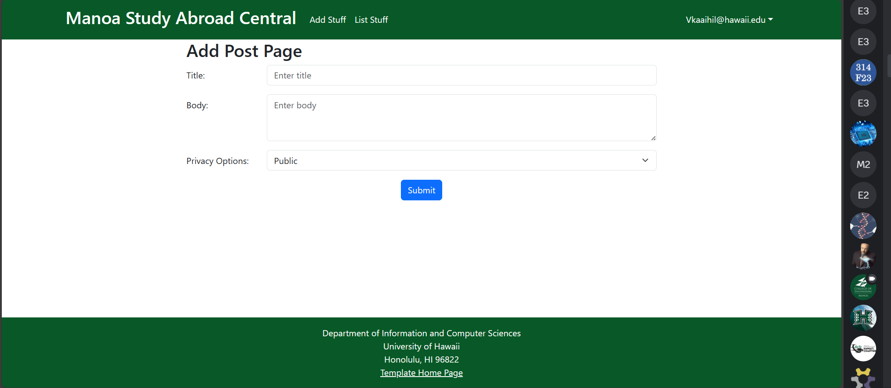
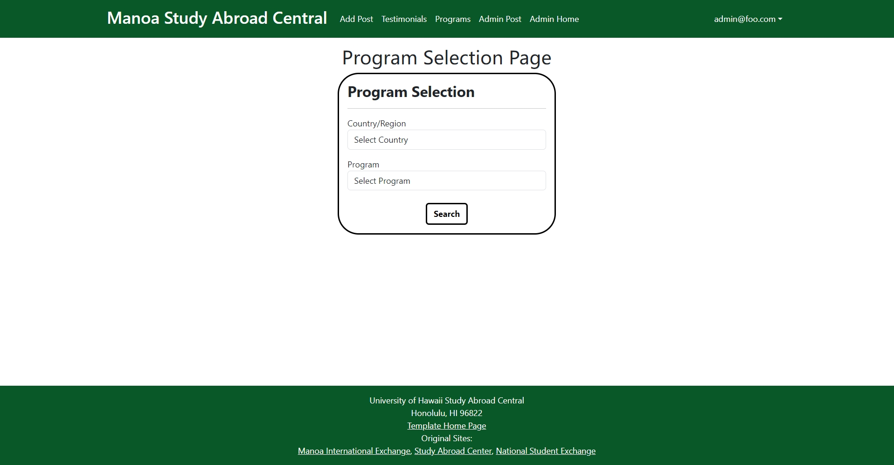
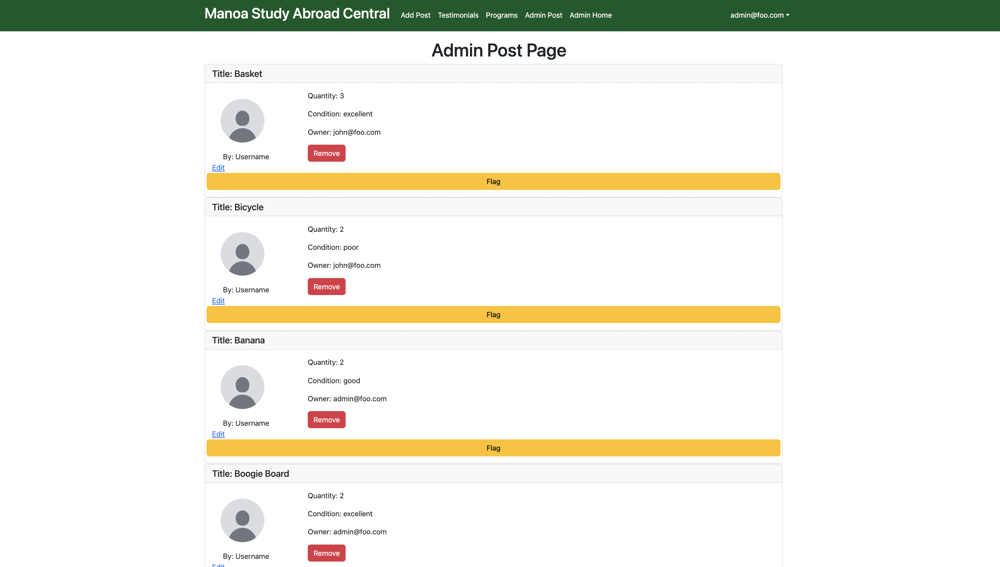
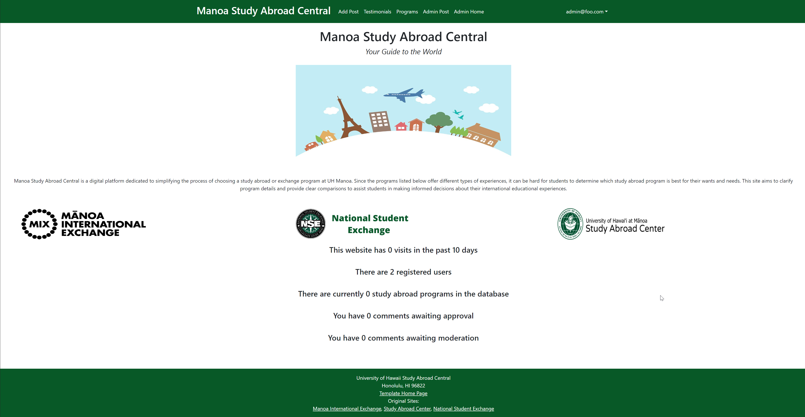

**Manoa Study Abroad Central Your Guide to the World**<br>
### What is it?
Manoa Study Abroad Central is a digital platform dedicated to simplifying the process of choosing a study abroad or exchange program at UH Manoa. It will be a user-friendly website designed to help students understand the various programs available to them, including the Manoa International Exchange (MIX), Study Abroad Center, and National Student Exchange (NSE). Since these programs offer different types of experiences, it can be hard for students to determine which study abroad program is best for their wants and needs. This site aims to clarify program details and provide clear comparisons to assist students in making informed decisions about their international educational experiences. It will also include testimonials from peers who have previously participated in these programs, offering valuable insights into the benefits and potential challenges of each option.<br>

## Team Members
• Junlang Chen<br>
• Victoria Ka'aihili<br>
• Masaya Oda<br>
• Yi Peng<br>
• Karissa Tabadero<br>

## Strategy
Our project follows the Issue Driven Project Management (IDPM) guidelines. We will be holding our meetings twice a week, specifically on Mondays and Thursdays from 5-6 PM via discord. We will be breaking our work into 72-hour tasks, each one logged as a GitHub issue. Every team member will take on two tasks, ensuring shared responsibility and progress. To track our development, we will establish milestones every 7-14 days. 

## Developer Guide

<strong>Step 1.</strong> Install [Meteor](https://www.meteor.com/developers/install), by following the steps according to your operating system. 

<strong>Step 2.</strong> Create your own version using the template. You can do this by clicking on the original template through our page, where it says generated from, and click "use this template."

<strong>Step3.</strong> Once you've downloaded the template to your computer, change directories (cd) into the app/ directory and install packages with:
```
$ meteor npm install
```
<strong>Step 4.</strong> Run the system with:
```
$ meteor npm run start
```
<strong>Step 5.</strong> If everything is done correctly, the application should appear at [http://localhost:3000]( http://localhost:3000)


## Deployment
[Manoa Study Abroad Central](https://manoa-study-abroad-central.xyz)

## Development History
### Final Project: [Milestone 1](https://github.com/orgs/manoa-study-abroad-central/projects/6)<br>
Current State of the Project:<br><br>
<br>
We setup the landing page to provide a concise overview of the website and listed the different programs available to the user.<br><br>
<br>
Users that are logged in are able to access the 'Add Post' page. Here they are prompted for a tile and body for their post. They can also set their privacy options.<br><br>
<br>
Users will be able to select the country/region or programs they are interested in.<br><br>
<br>
Here, admin can view all posts, remove posts, or flag posts.<br><br>
<br>
The admin homepage allows for administrators to view statistics and moderate posts.


### Final Project: [Milestone 2](https://github.com/orgs/manoa-study-abroad-central/projects/9/views/1)<br>
### Final Project: [Milestone 3](https://github.com/orgs/manoa-study-abroad-central/projects/8/views/1)<br>

## Links
[Github Organization](https://github.com/manoa-study-abroad-central/manoa-study-abroad-central.github.io/tree/main)
[Team Contract](https://docs.google.com/document/d/1Yv8-43MoE4xzP9Gig0bwpPvJU8siF7iYQRA5ayEzNgk/edit?usp=sharing)
[Project Proposal](https://mair1.github.io/essays/final-project-idea.html)
[IDPM Guidelines](https://courses.ics.hawaii.edu/ics314f23/morea/project-management/reading-guidelines-idpm.html)


