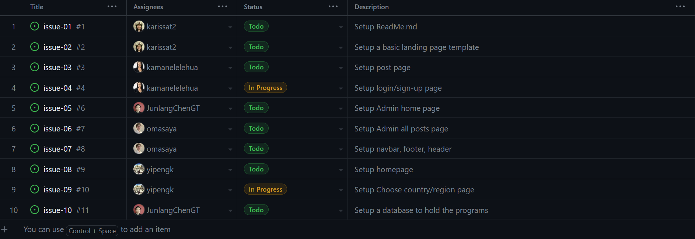

**Manoa Study Abroad Central Your Guide to the World** 
The Manoa Study Abroad Central is a digital platform dedicated to simplifying the process of choosing a study abroad or exchange program at UH Manoa. It will be a user-friendly website designed to help students understand the various offerings available to them, including the Manoa International Exchange (MIX), Study Abroad Center, and National Student Exchange programs. The site will aim to clarify program details and provide clear comparisons to assist students in making informed decisions about their international educational experiences. It will also includes testimonials from peers who have previously participated in these programs, which offer valuable insights into the benefits and potential challenges of each option.  

Our website's home page will offer an overview of the platform's features and services. Here, users will be able to click a link that will take them to the login/signup page. After signing in, students will then be able to select their desired destination and navigate to a feed of posts, where they're invited to join the conversation through comments. The 'Add Post' page will be available for students to share their own personal experiences. For administrators, there will be a dedicated home page for managing the platform's operations and an 'Admin All Posts' page for monitoring and updating user contributions, ensuring the content remains relevant and useful. Additionally, the website will provide in-depth information about the study abroad opportunities, allowing visitors to gain a thorough understanding of the options.

## Team Members
• Junlang Chen 
• Victoria Ka'aihili 
• Masaya Oda 
• Yi Peng 
• Karissa Tabadero 

## Strategy
Our project follows the Issue Driven Project Management (IDPM) guidelines. We will be holding our meetings twice a week, specifically on Mondays and Thursdays from 5-6 PM via discord. We will be breaking our work into 72-hour tasks, each one logged as a GitHub issue. Every team member will take on two tasks, ensuring shared responsibility and progress. To track our development, we will establish milestones every 7-14 days. 

## Development History
### Final Project: Milestone 1 

### Final Project: Milestone 2 
### Final Project: Milestone 3 

## Links
[Team Contract](https://docs.google.com/document/d/1Yv8-43MoE4xzP9Gig0bwpPvJU8siF7iYQRA5ayEzNgk/edit?usp=sharing)
[Project Proposal](https://mair1.github.io/essays/final-project-idea.html)
[IDPM Guidelines](https://courses.ics.hawaii.edu/ics314f23/morea/project-management/reading-guidelines-idpm.html)
[Milestone 1](https://courses.ics.hawaii.edu/ics314f23/morea/final-project/experience-final-project-m1.html)
[Milestone 2](https://courses.ics.hawaii.edu/ics314f23/morea/final-project/experience-final-project-m2.html)
[Milestone 3](https://courses.ics.hawaii.edu/ics314f23/morea/final-project/experience-final-project-m3.html)
[GitHub Link](https://github.com/manoa-study-abroad-central/manoa-study-abroad-central.github.io)
