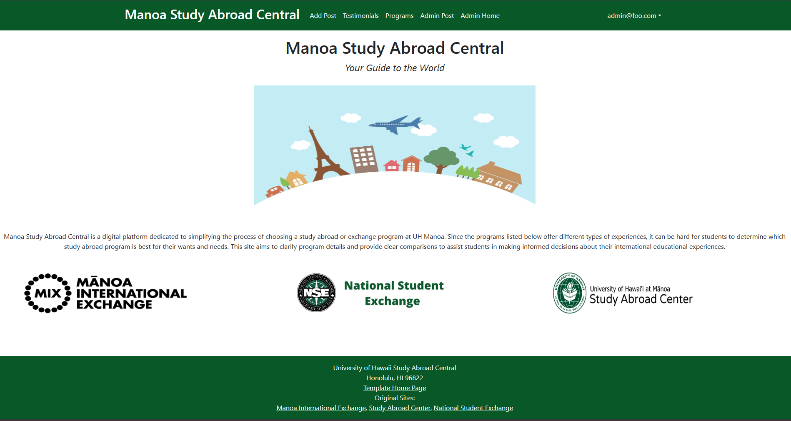

**Manoa Study Abroad Central Your Guide to the World** 
### What is it?
Manoa Study Abroad Central is a digital platform dedicated to simplifying the process of choosing a study abroad or exchange program at UH Manoa. It will be a user-friendly website designed to help students understand the various programs available to them, including the Manoa International Exchange (MIX), Study Abroad Center, and National Student Exchange (NSE). Since these programs offer different types of experiences, it can be hard for students to determine which study abroad program is best for their wants and needs. This site aims to clarify program details and provide clear comparisons to assist students in making informed decisions about their international educational experiences. It will also include testimonials from peers who have previously participated in these programs, offering valuable insights into the benefits and potential challenges of each option. 

### How will we do it?
 
Our website's landing page will offer an overview of the platform's features and services. Here, users will be able to click a link that will take them to the login/signup page.  

  

 
After signing in, users will then be able to select their desired destination or programs.  

 
Users can then navigate to the Post Feed Page, where they're invited to join the conversation through comments, like the posts, or share the post.  

 
The 'Add Post' page will be available for users to share their own personal experiences.  

 
For administrators, there will be a dedicated home page for managing the platform's operations.  

 
There will also be an 'Admin All Posts' page for monitoring and updating user contributions, ensuring the content remains relevant and useful.  

Additionally, the website will provide in-depth information about the study abroad opportunities, allowing visitors to gain a thorough understanding of the options.

## Team Members
• Junlang Chen 
• Victoria Ka'aihili 
• Masaya Oda 
• Yi Peng 
• Karissa Tabadero 

## Strategy
Our project follows the Issue Driven Project Management (IDPM) guidelines. We will be holding our meetings twice a week, specifically on Mondays and Thursdays from 5-6 PM via discord. We will be breaking our work into 72-hour tasks, each one logged as a GitHub issue. Every team member will take on two tasks, ensuring shared responsibility and progress. To track our development, we will establish milestones every 7-14 days. 

## Deployment
[Manoa Study Abroad Central](http://143.244.153.70)

## Development History
### Final Project: [Milestone 1](https://github.com/orgs/manoa-study-abroad-central/projects/6) 
Current State of the Project:  
 
We setup the landing page to provide a concise overview of the website and listed the different programs available to the user.  
 
Users are able to register an account.  
 
Once the user has registered their account they can login.  
 
Users that are logged in are able to access the 'Add Post' page. Here they are prompted for a tile and body for their post. They can also set their privacy options.  
 
Users will be able to select the country/region or programs they are interested in.  
 
Here, admin can view all posts, remove posts, or flag posts. 

### Final Project: [Milestone 2](https://github.com/orgs/manoa-study-abroad-central/projects/9/views/1) 
### Final Project: [Milestone 3](https://github.com/orgs/manoa-study-abroad-central/projects/8/views/1) 

## Links
[Github Organization](https://github.com/manoa-study-abroad-central/manoa-study-abroad-central.github.io/tree/main)
[Team Contract](https://docs.google.com/document/d/1Yv8-43MoE4xzP9Gig0bwpPvJU8siF7iYQRA5ayEzNgk/edit?usp=sharing)
[Project Proposal](https://mair1.github.io/essays/final-project-idea.html)
[IDPM Guidelines](https://courses.ics.hawaii.edu/ics314f23/morea/project-management/reading-guidelines-idpm.html)

